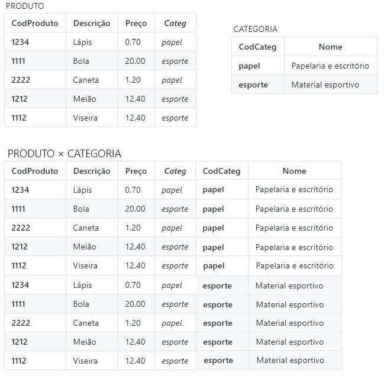
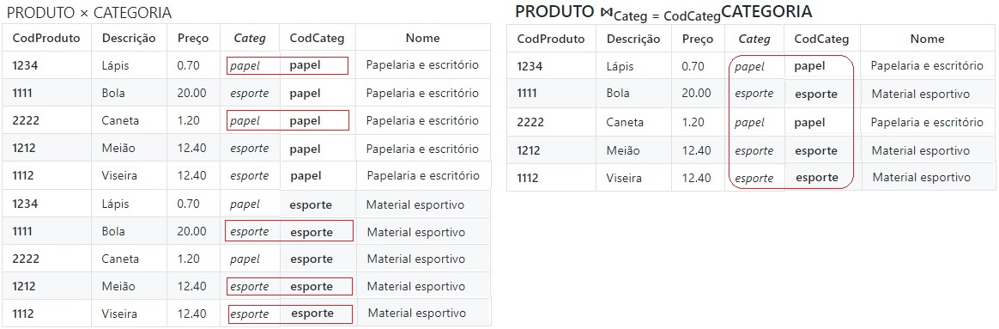
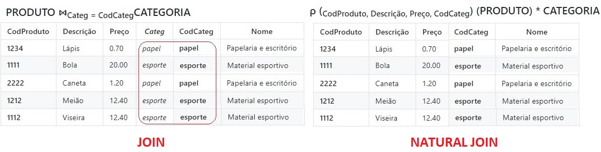

## [Tópico T10] - Álgebra Relacional - Produto Cartesiano e Junção
###### *by Prof. Plinio Sa Leitao-Junior (INF/UFG)*

### Operação PRODUTO CARTESIANO (CARTESIAN PRODUCT) ou PRODUTO CRUZADO (CROSS PRODUCT)

A Operação PRODUTO CARTESIANO é usada para a combinação (concatenação) de _tuplas_:
- É uma operação baseada em conjuntos.
- O símbolo **×** identifica a operação.
- A operação produz uma nova relação (novo conjunto), em que cada elemento é uma combinação (concatenação) de cada elemento (_tupla_) de uma relação (conjunto) com cada elemento (_tupla_) de outra relação (conjunto).
- O resultado do produto cartesiano entre R(A<sub>1</sub>, A<sub>2</sub>, ..., A<sub>n</sub>) e S(B<sub>1</sub>, B<sub>2</sub>, ..., B<sub>m</sub>) é:
  - uma relação Q com **grau (n + m) atributos**, cujo esquema é: **Q(A<sub>1</sub>, A<sub>2</sub>, ..., A<sub>n</sub>, B<sub>1</sub>, B<sub>2</sub> ,…, B<sub>m</sub>)**;
  - se **n<sub>R</sub>** e **n<sub>S</sub>** são os números de _tuplas_ em R e S, denotados por **n<sub>R</sub>=|R|** e **n<sub>S</sub>=|S|**, respectivamente, então Q terá **(n<sub>R</sub> * n<sub>S</sub>)** _tuplas_.

#### PRODUTO CARTESIANO Exemplo 1:
Observe o resultado da expressão **PRODUTO × CATEGORIA** na figura abaixo:
- PRODUCT tem 04 atributos e CATEGORIA tem 02 atritbutos:
  - PRODUTO × CATEGORIA tem 06 atributos.
- PRODUCT tem 05 _tuplas_ e CATEGORIA tem 02 _tuplas_:
  - PRODUTO × CATEGORIA tem 10 _tuplas_.



> Se usada de forma isolada, a operação PRODUTO CARTESIANO usualmente não possui resultados práticos:
>> &#8718; Contudo, possui valor para fins didáticos.<br>
>> &#8718; Pode ser útil se utilizada conjuntamente com a seleção de _tuplas_; por exemplo, selecionar somente as combinações (concatenações) entre _tuplas_ que são relacionadas entre si.<br>
>> &#8718; A operação JUNÇÃO representa uma alternativa valiosa à operação PRODUTO CARTESIANO.

### Operação JUNÇÃO (JOIN)

A **Operação JUNÇÃO** é usada para a combinação (concatenação?) de _tuplas_, desde que **uma condição de seleção seja verdadeira** (um predicado seja atendido):
- O símbolo **&#8904;** identifica a operação.
- A condição de seleção presente na JUNÇÃO é denominada **predicado de junção**.
- O resultado da JUNÇÃO é um subconjunto do resultado da PRODUTO CARTESIANO?
- As duas expressões abaixo são equivalentes? Ou seja, as expressões produzem o mesmo resultado?
  - **R &#8904;<sub>predicado</sub> S**
  - **σ<sub>predicado</sub> (R × S)**

#### JUNÇÃO Exemplo 1:
Observe o resultado da expressão **PRODUTO &#8904;<sub>Categ = CodCateg</sub>CATEGORIA** na figura abaixo:
- Didaticamente, podemos comparar PRODUTO CARTESIANO e JUNÇÃO:
  - dentre as _tuplas_ (elementos) resultantes da PRODUTO CARTESIANO (na figura à esq.), são selecionadas _tuplas_ (elementos) para a JUNÇÃO (na figura à dir.);
  - as _tuplas_ selecionadas devem satisfazer ao predicado **Categ = CodCateg**.



#### JUNÇÃO THETA (THETA JOIN)
Sobre a junção entre as _tuplas_ de R e S, o predicado tipicamente assume a seguinte forma genérica:
- **<condição> AND <condição> AND ... AND <condição>**:
  - **<condição>** possui o formato **A<sub>i</sub> θ B<sub>j</sub>**;
  - **A<sub>i</sub>** é um atributo de **R**;
  - **B<sub>j</sub>** é um atributo de **S**;
  - **A<sub>i</sub>** e **B<sub>j</sub>** têm o mesmo domínio;
  - **θ** (theta) é um dos operadores de comparação em **{=, < , ≤,>, ≥, ≠}**.
- Ou seja, a **JUNÇÃO THETA** permite o uso de qualquer dos operadores de comparação em {=, < , ≤,>, ≥, ≠}:
  - ou seja, a **JUNÇÃO THETA** não é restrita ao operador de igualdade;
  - por exemplo, o predicado **Categ > CodCateg** pode ser usado em **JUNÇÃO THETA** (em vez de o predicado **Categ = CodCateg**).

#### EQUIJUNÇÃO (EQUIJOIN)

A **Operação JUNÇÃO** é comumente usada com o **operador de igualdade**, para explorar as associações entre _tuplas_ em Bancos de Dados Relacionais:
- A **EQUIJUNÇÃO** é a JUNÇÃO que usa apenas o **operador de igualdade**.
- A expressão em **JUNÇÃO Exemplo 1** é uma **EQUIJUNÇÃO**:
  - **PRODUTO &#8904;<sub>Categ = CodCateg</sub>CATEGORIA**

### Operação JUNÇÃO NATURAL (NATURAL JOIN)

Observemos, novamente, o resultado obtido em **JUNÇÃO Exemplo 1**:
- A expressão é uma EQUJUNÇÃO:
  - **PRODUTO &#8904;<sub>Categ = CodCateg</sub>CATEGORIA**.
- A figura (à dir.) demonstra que há valores repetidos no resultado da operação:
  - os atributos **Categ** e **CodCateg** estão no predicado da EQUIJUNÇÃO (**Categ = CodCateg**);
  - portanto, os valores associados aos atributos **Categ** e **CodCateg** caracterizam repetição de dados no resultado da consulta, conforme ressaltado na figura (duas colunas em que todos os valores são iguais).

A **Operação JUNÇÃO NATURAL** elimina repetições de dados (colunas repetidas), que são em decorrência dos atributos presentes no predicado de EQUIJOIN:
- O símbolo **&#42;** identifica a operação:
  - alguns autores empregam o símbolo **&#8904;** isolado (sem ser seguido por um predicado de JUNÇÃO).
- A JUNÇÃO NATURAL não possui, explicitamente, um predicado de JUNÇÃO:
  - então, como saber **que predicado de JUNÇÃO** aplicar a JUNÇÃO NATURAL, se nenhum predicado está explícito?
  - ao aplicar a JUNÇÃO NATURAL entre **R** e **S**, deve haver **pelo menos um atributo com o mesmo nome** em R e em S:
    - os atributos de mesmo nome são usados no **predicado implícito de JUNÇÃO NATURAL**;
    - sejam R(A<sub>1</sub>, A<sub>2</sub>, ..., X<sub>1</sub>, ... A<sub>n</sub>) e S(B<sub>1</sub>, B<sub>2</sub>, ..., X<sub>1</sub>, ... B<sub>m</sub>), então o atributo de mesmo nome em R e S é **X<sub>1</sub>**;
    - a expressão **R * S** irá aplicar o predicado implícito **R.X<sub>1</sub>=S.X<sub>1</sub>** para a JUNÇÃO NATURAL.

#### JUNÇÃO Exemplo 2

Sobre as relações PRODUTO e CATEGORIA em "PRODUTO CARTESIANO Exemplo 1", considere as observações:
- Os esquemas dessas relações não possuem atributos com nomes comuns:
  - em PRODUTO, há os atributos _CodProduto_, _Descrição_, _Preço_ e _Categ_;
  - em CATEGORIA, já os atributos _CodCateg_ e _Nome_.
- Para aplicar a JUNÇÃO NATURAL entre PRODUTO e CATEGORIA é necessário:
  - alterar o nome do atributo _Categ_ em PRODUTO (alterar para _CodCateg_); ou
  - alterar o nome do atributo _CodCateg_ em CATEGORIA (alterar para _Categ_).

Ambas as sequências de expressões abaixo implementam a JUNÇÃO NATURAL entre PRODUTO e CATEGORIA:<br>
&#8718; **TEMP(<sub>CodProduto, Descrição, Preço, CodCateg</sub>) &#8592; PRODUTO**<br>
&#8718; **RESULT &#8592; TEMP * CATEGORIA**<br>
OU<br>
&#8718; **RESULT &#8592; ρ (<sub>CodProduto, Descrição, Preço, CodCateg</sub>) (PRODUTO) * CATEGORIA**

> **A figura a seguir ilustra a distinção entre as operações JUNÇÃO e JUNÇÃO NATURAL.**



### Em síntese

```diff
+ Um banco de dados relacional tipicamente possui muitas tuplas.
- Fatos do mundo real estão decompostos em várias tuplas.
+ Cada tupla se associa com, pelo menos, uma outra tupla.
- A Operação JUNÇÃO combina tuplas relacionadas entre si.
```

## Atividade (data limite: **xx/xx/xxxx 23h59min59s**)

Considere o esquema lógico do **BD Simples**:<br>
&#8718; PRODUTO(CodProduto, Descrição, Preço, _Categ_), cuja chave primária (PK) é **CodProduto**;<br>
&#8718; CATEGORIA(CodCateg, Nome), cuja chave primária (PK) é **CodCateg**;<br>
&#8718; PRODUTO(Categ) REFERENCIA CATEGORIA(CodCateg).

Considere, também, o [conteúdo do] banco de dados na figura que ilustra **PRODUTO CARTESIANO Exemplo 1**:<br>
&#8718; em CATEGORIA há 02 _tuplas_;<br>
&#8718; em PRODUTO há 05 _tuplas_.

A seguinte sequência de expressões da álgebra relacional foi aplicada ao **BD Simples**:<br>
&#8718; AUX1 &#8592; π <sub>CodProduto, Descrição, Preço</sub> (PRODUTO)<br>
&#8718; AUX2 &#8592; π <sub>CodProduto, Descrição, Preço</sub> (PRODUTO)<br>
&#8718; AUX3 &#8592; π AUX1.Preço (AUX1 &#8904;<sub>AUX1.Preço < AUX2.Preço</sub> AUX2)<br>
&#8718; AUX4 &#8592; π AUX2.Preço (AUX1 &#8904;<sub>AUX1.Preço < AUX2.Preço</sub> AUX2)<br>
&#8718; AUX5 &#8592; π AUX1.Preço (AUX1 &#8904;<sub>AUX1.Preço <= AUX2.Preço</sub> AUX2)<br>
&#8718; AUX6 &#8592; π AUX2.Preço (AUX1 &#8904;<sub>AUX1.Preço <= AUX2.Preço</sub> AUX2)<br>

Criar uma _issue_ no projeto https://github.com/plinioleitao/bd-2021-1-bxx, com o título "Tópico 10", para responder:  
1. Qual o conteúdo da relação AUX3 ?<br>
1. Qual o conteúdo da relação AUX4 ?<br>
1. Qual o conteúdo da relação AUX5 ?<br>
1. Qual o conteúdo da relação AUX6 ?

As respostas possíveis se referem aos preços dos produtos, podendo ser:<br>
&#8718; Nenhum preço (conjunto vazio)<br>
&#8718; Todos os preços<br>
&#8718; Todos os preços, exceto o menor preço<br>
&#8718; Todos os preços, exceto o maior preço<br>
&#8718; Somente o menor preço<br>
&#8718; Somente o maior preço

Responda segundo o modelo (apenas um modelo):
1. AUX3: Nenhum preço (conjunto vazio)
1. AUX4: Todos os preços
1. AUX5: ...
1. AUX6: ...

RESPOSTA:
1. AUX3: Todos os preços, exceto o maior preço
1. AUX4: Todos os preços, exceto o menor preço
1. AUX5: Todos os preços
1. AUX6: Todos os preços

## Artefatos

1. _Issue_ criada no projeto https://github.com/plinioleitao/bd-2021-1-bxx, cujo título é "Tópico 10", para indicar suas reflexões iniciais sobre conceitos da *álgebra relacional*.
