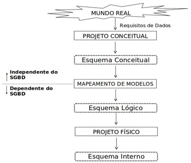
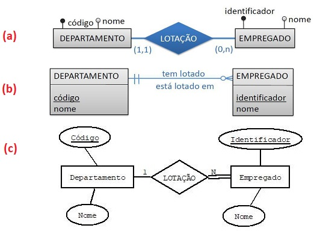
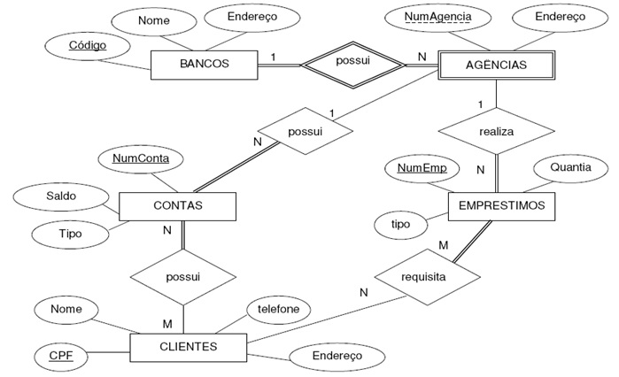

## [Tópico T22] - Modelo Entidade Relacionamento (MER) - Primeiros passos e _Checklist_
###### *by Prof. Plinio Sa Leitao-Junior (INF/UFG)*

**Modelos de dados** promovem a percepção abstrata em níveis para o banco de dados. Nesse sentido, cada modelo de dados se refere a um nível de abstração próprio, para guiar a criação e a evolução de um esquema de banco de dados. A figura a seguir apresenta níveis de abstração para os vários esquemas de um mesmo banco de dados.

O **Modelo Entidade Relacionamento (MER)** é comumente aplicado na etapa *projeto conceitual do banco de dados*. O projeto conceitual lida com a *especificação conceitual do banco de dados* (**esquema conceitual**), que é uma representação em uma abstração de alto-nível nível, cujo entendimento é mais próximo de usuários não especializados.

O **projeto conceitual** pelo emprego do **MER** busca abstrair uma **coleção de elementos conceituais** pertinentes aos dados. Essa abstração de elementos conceituais envolve o entendimento das responsabilidades informacionais próprias do banco dados. Cada desses elementos conceituais é inicialmente classificado como **[tipo de] entidade**, **[tipo de] relacionamento entre entidades** ou **atributo**. O processo evolui de forma iterativa e incremental, potencialmente com alterações na classificação inicial, até que amadureça uma representação conceitual do banco de dados, ou seja, um esquema conceitual.

Não é trivial determinar como um elemento conceitual do mundo real será tratado no MER. Dois projetistas distintos podem ter percepções conceituais diferentes sobre o banco de dados de uma aplicação. Então, **precisamos praticar bastante** para aos poucos ganhar maturidade. É um trabalho contínuo, um **bom projetista** sabe que este trabalho nunca terminará.

Algumas questões pertinentes são:
- Como saber **se um dado elemento conceitual é relevante** para o projeto conceitual pelo emprego do MER? Ou seja, esse elemento conceitual deve ser considerado no âmbito do projeto do banco de dados?
- Se o elemento conceitual for relevante, **como classificá-lo** em [tipo de] entidade, [tipo de] relacionamento entre entidades ou atributo? Ou seja, há critério que apoie essa classificação?

O produto do MER – esquema conceitual – pode ser representado por um diagrama, denominado **Diagrama Entidade Relacionamento (DER)**. O DER possui muitas notações, algumas muito conhecidas, tais com as três apresentadas na figura abaixo. O importante é que todas as notações representam as mesmas ideias. Na figura há dois tipos de entidade (DEPARTAMENTO e EMPREGADO) e um tipo de relacionamento (LOTAÇÃO). 

Ao ler e reler os três diagramas - Diagramas (a), (b) e (c) na figura - você consegue concluir a seguinte interpretação para o tipo de relacionamento LOTAÇÃO: "*um departamento possui de zero a N empregados lotados, um empregado sempre está lotado em um único departamento*"?

### _Checklist_

Vimos que um **modelo de dados** é uma ***coleção de conceitos*** que podem ser usados para descrever a estrutura de um banco de dados, relacionamentos de dados, semântica de dados e restrições de consistência.

Para o Modelo Entidade Relacionamento (MER), um *checklist* com a maioria dos conceitos deste modelo é apresentado abaixo.

1. Modelo Entidade-Relacionamento (ER), Diagrama ER, Unified Modeling Language (UML)
1. Requisitos de dados, Requisitos de software
1. Esquema conceitual de banco de dados, Projeto conceitual de banco de dados
1. Projeto lógico de banco de dados (ou mapeamento dentre modelos de dados), Projeto físico de banco de dados
1. Entidade, Relacionamento, Atributo
1. Tipo de entidade, Entidade, Instância de entidade
1. Tipo de relacionamento, Relacionamento, Instância de relacionamento
1. Atributo, Domínio de atributo
1. Atributo com valor requerido, Atributo sem valor requerido, Atributo chave
1. Atributo com valor repetível, Atributo valor não repetível, Atributo chave
1. Atributo Simples, Atributo composto
1. Atributo monovalorado, Atributo multivalorado
1. Atributo com valor armazenado, Atributo com valor derivado
1. Valor nulo, Valor não nulo
1. Grau binário de um tipo de relacionamento, Grau ternário de um tipo de relacionamento, Grau **N** de um tipo de relacionamento
1. Tipo de relacionamento recursivo, Tipo de relacionamento não recursivo
1. Restrição de participação total, Restrição de participação parcial
1. Restrição de Cardinalidade: 1:1 , 1:N , N:N
1. Tipo de entidade fraca, Tipo de relacionamento de identificação
1. Atributo de entidade, Atributo de relacionamento
1. Especialização exclusiva, especialização não exclusiva
1. Generalização parcial, generalização total

>Para que que haja melhor fluência no emprego do MER, é pertinente e importante que entendamos **todos** os conceitos presentes no ***checklist* de conceitos** do MER, apresentado acima.

Esses conceitos serão empregados nos próximos tópicos. Contudo, desde já é mandatório que sejam lidos e estudados os Capítulos 7 e 8 do livro sugerido[1].

[1] ELMASRI, R.; NAVATHE, S. B. Sistemas de Banco de Dados. 6. ed. Pearson, 2011.

## Atividade (data limite: **xx/xx/xxxx 23h59min59s**)

Considere o seguinte diagrama:

Criar uma _issue_ no projeto https://github.com/plinioleitao/bd-2021-1-bxx, com o título "Tópico 22", para responder:  

1. Uma agência realiza de zero a vários empréstimos, e um empréstimo ocorre em uma e somente uma agência? (Responda Sim ou Não) Sim
1. Um cliente requisita de zero a vários empréstimos, e um mesmo empréstimo ocorre para um ou mais clientes? (Responda Sim ou Não) Sim
1. Qualquer conta está associada a pelo menos um cliente e a pelo menos uma agência? (Responda Sim ou Não) Sim
1. Qualquer empréstimo está associado a pelo menos um cliente e a pelo menos uma agência? (Responda Sim ou Não) Sim
1. Um banco possui de zero a várias agências, e uma agência está associada a um e somente um banco? (Responda Sim ou Não) Não
   
## Artefatos

1. _Issue_ criada no projeto https://github.com/plinioleitao/bcc-bd-2020-2, cujo título é "Tópico 08", para indicar suas reflexões iniciais sobre *diagrama entidade relacionamento*.
