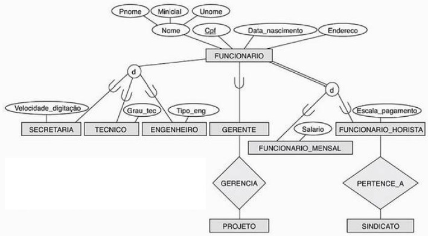
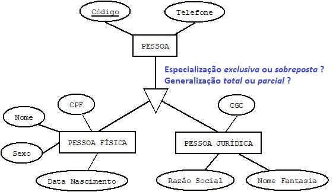
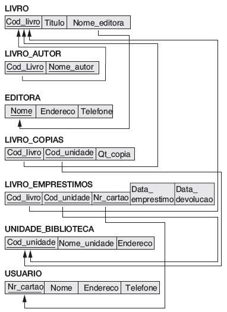

## [Tópico T31] - Mapeamento MER para MR (parte 4)
###### *by Prof. Plinio Sa Leitao-Junior (INF/UFG)*

> Motivação: Qual o esquema lógico pertinente ao DER abaixo:

### Regra 08 - Mapeamento de Especialização/Generalização

Para ilustrar, considere o esquema conceitual (DER) do **BD simples**, mostrado a seguir.

Como mapear cada hierarquia de generalização/especialização? 
Abstratamente, considere que:
- **SUPER** é a superclasse que possui **n+1** atributos - **{k, a1, ..., an}** - tal que **k** é o atributo chave;
- Há **m** subclasses **{SUB1, SUB2, ..., SUBm}**.

#### OPÇÃO 1: Relações múltiplas - superclasse e subclasses

- Alternativa adequada para **qualquer generalização** (total ou parcial) e **qualquer especialização** (disjunta ou sobreposta).
- Criar uma relação **R_SUPER** para a superclasse **SUPER**:
  - com os atributos **Attrs(R_SUPER) = {k, a1,…, an}**; e
  - **PK(R_SUPER) = k**.
- Criar uma relação **R_SUBi** para cada subclasse **SUBi**, **1 ≤ i ≤ m**:
  - os atributos **Attrs(R_SUBi) = {k} ∪ {atributos de SUBi}**;
  - **PK(R_SUBi) = k**.

Sobre o **BD Simples**, a aplicação desta opção resulta em:

|Esquema de relação|
|-|
|CLIENTE (CodCli, Fone) CLIENTE (CodCli) IS PRIMARY KEY|
|PESSOAJURIDICA (CodCli, CGC, RazaoSocial) PESSOAJURIDICA (CodCli) IS PRIMARY KEY PESSOAJURIDICA (CodCli) REFERENCES CLIENTE (CodCli)|
|PESSOAFISICA (CodCli, CPF, Nome, DataNasc, Sexo) PESSOAFISICA (CodCli) IS PRIMARY KEY PESSOAFISICA (CodCli) REFERENCES CLIENTE (CodCli)|

#### OPÇÃO 2: Relações múltiplas - restrito a subclasses

- Alternativa adequada para **generalização total** e **especialização exclusiva**:
  - se a especialização se sobrepõe, a mesma entidade pode ser duplicada em várias relações.
- Criar uma relação **R_SUBi** para cada subclasse **SUBi**, **1 ≤ i ≤ m**:
  - os atributos **Attrs(R_SUBi) = {k, a1,…, an} ∪ {atributos de SUBi}**;
  - **PK(R_SUBi) = k**.

Sobre o **BD Simples**, a aplicação desta opção resulta em:

|Esquema de relação|
|-|
|PESSOAJURIDICA (CodCli, Fone, CGC, RazaoSocial) PESSOAJURIDICA (CodCli) IS PRIMARY KEY|
|PESSOAFISICA (CodCli, Fone, CPF, Nome, DataNasc, Sexo) PESSOAFISICA (CodCli) IS PRIMARY KEY|

#### OPÇÃO 3: Relação única, com um atributo de tipo de especialização

- Alternativa adequada para **especialização exclusiva**:
  - pode haver elevado número de valores nulos, se há muitos atributos específicos nas subclasses.
- Criar uma única relação **R_SUPER** para ambas, a superclasse e todas as subclasses **SUBi**, **1 ≤ i ≤ m**:
  - os atributos **Attrs(R_SUPER) = {k, a1,…, an} ∪ {atributos de SUB1} ∪ {atributos de SUB2} ∪ ... ∪ {atributos de SUBm} ∪ {t}**;
  - o atributo **t** é chamado **atributo de tipo** (ou _atributo discriminante_), cujo valor indica a subclasse à qual cada _tupla_ pertence, se houver;
  - **PK(R_SUPER) = k**.

Sobre o **BD Simples**, a aplicação desta opção resulta em:

|Esquema de relação|
|-|
|PESSOA (CodCli, **Tipo**, Fone, CGC, RazaoSocial, CPF, Nome, DataNasc, Sexo) PESSOA (CodCli) IS PRIMARY KEY|

#### OPÇÃO 4: Relação única, com multiplos atributos de tipo de especialização

- Alternativa adequada para especialização cujas subclasses estão sobrepostas.
- Criar uma única relação **R_SUPER** para ambas, a superclasse e todas as subclasses **SUBi**, **1 ≤ i ≤ m**:
  - os atributos **Attrs(R_SUPER) = {k, a1,…, an} ∪ {atributos de SUB1} ∪ {atributos de SUB2} ∪ ... ∪ {atributos de SUBm} ∪ {t1, t2,…, tm}**;
  - Cada **ti**, **1 ≤ i ≤ m**, é um atributo do tipo booleano que indica se uma _tupla_ pertence ou não à subclasse **SUBi**.
  - **PK(R_SUPER) = k**.

Sobre o **BD Simples**, a aplicação desta opção resulta em:

|Esquema de relação|
|-|
|PESSOA (CodCli, **Tipo_pessoa_fisica**, **Tipo_pessoa_juridica**, Fone, CGC, RazaoSocial, CPF, Nome, DataNasc, Sexo) PESSOA (CodCli) IS PRIMARY KEY|

## Atividade (data limite: **xx/xx/xxxx 23h59min59s**)

Crie o diretório **topico-31** no seu repositório https://github.com/nomealuno/bd-2021-1-bxx, onde **nomealuno** é o nome da conta do aluno no Github. Este é o repositório que você criou no início da disciplina.

Neste diretório você deverá depositar um arquivo JPG, contendo a imagem de um DER conforme solicitado na atividade. **Atenção às diretrizes abaixo**:
- Use a ferramenta que desejar, desde que a especificação do DER tenha **precisamente** a notação apresentada no [Tópico 22](./topico-22.md):
  - Sugestão: use a ferramenta [Dia](http://dia-installer.de/), que é uma ferramenta de desenho:
    - para especificar o DER, selecione a *Folha* **ER** (em vez da *Folha* **Banco de Dados**);
    - ao final, exporte o desenho para um arquivo JPG.
- Ao 'depositar' o arquivo no diretório, checar se as dimensões da imagem do diagrama estão ajustadas à area de apresentação no GitHub (não deve ser muito pequeno a ponto de tornar-se ilegível, nem grande demais a ponto de ser necessário **rolar** (*to scroll*) para visualizar).
- Faça você mesmo, evite olhar respostas prontas.  Novamente, convém citar Cora Coralina para esclarecer o objetivo da atividade: "O que vale na vida não é o ponto de partida e sim a caminhada. Caminhando e semeando, no fim terás o que colher".

A atividade considera o esquema lógico do BD Biblioteca, conforme a figura abaixo.

1. Desenhe um DER para o BD Biblioteca, o qual pode ser mapeado para obter o esquema lógico do BD Biblioteca. 
Aplique **precisamente** a notação apresentada no [Tópico 22](./topico-22.md).

### Uma solução

## Artefatos

1. Diretório **topico-31**, criado no repositório do estudante, com o DER do BD Biblioteca.
