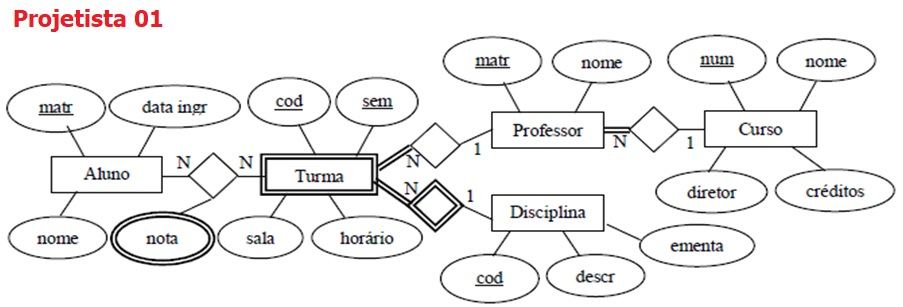
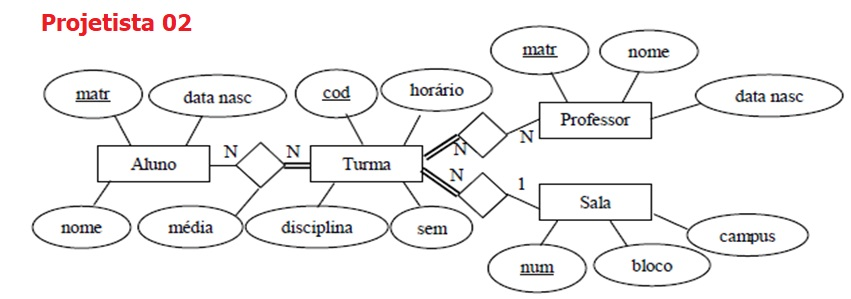
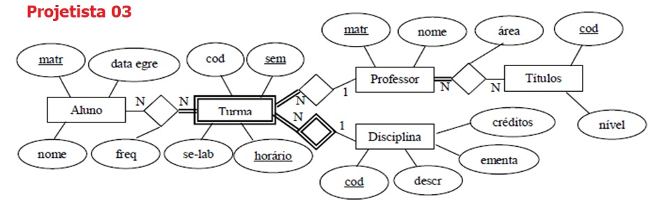

## [Tópico T33a] - Exercício
###### *by Prof. Plinio Sa Leitao-Junior (INF/UFG)*

Três projetistas de banco de dados - Projetista 01, Projetista 02 e Projetista 03 - foram contratados para elaborar o esquema conceitual segundo o Medelo Entidade Relacionamento, referente ao banco de dados de uma universidade: **BD Universidade**, conforme ilustrado nas figuras abaixo.

### Observações pertinentes

- Os atributos **data ingr** e **data egre** referem-se à data de ingresso e de egresso do aluno na instituição.
- O atributo **sem** refere-se ao semestre (e ano) em que uma turma é oferecida.
- O atributo **freq** refere-se à frequência de um aluno em uma turma.
- O tipo de entidade **Títulos** refere-se às titulações de cada professor; por exemplo, nível mestrado.
- O atributo **se-lab** indica se a turma possui aulas de laboratório.
- O atributo **horário** determina o horário (e o dia da semana) para a turma.
- O atributo **créditos** em **Disciplina** refere-se ao número de horas semanais para uma disciplina.
- O atributo **créditos** em **Curso** refere-se ao número mínimo de horas para um curso.
- Para ser aprovado, um aluno deve ser aprovado por frequência e por média.
- Um aluno é reprovado por média, se a média aritmética de notas for inferior a 7,0 (sete vírgula zero).
- Um aluno é reprovado por frequência, se a frequência for inferior a 75% (setenta e cinco por cento).

### Demandas informacionais solicitadas pelo controle acadêmico 

## Não há atividade para este tópico, excepcionalmente.
