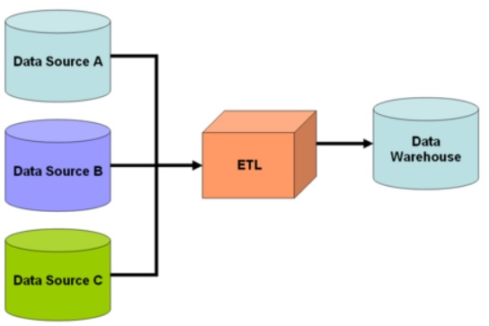
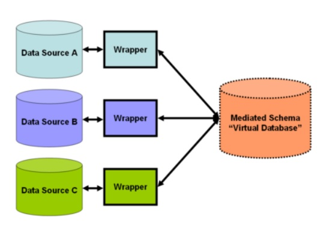

## [Tópico T34a] - Integração de dados no projeto Sissa
###### *by Prof. Plinio Sa Leitao-Junior (INF/UFG)*

### Integração de dados

Integração de dados se refere ao acesso, preferencialmente uniforme, a fontes de dados autônomas e heterogêneas. Noutras palavras, ter visão unificada dos dados de múltiplas fontes de dados díspares, internas e/ou externas. 

Algumas observações pertinenetes:
- O acesso aos dados (por exemplo, consultas) deve ocorrer de maneira uniforme (conteúdo e estrutura), mesmo no cenário de fontes heterogêneas:
  - idealmente, deve haver independência em relação a alterações nas fontes de dados;
  - por exemplo, as fontes podem alterar seus formatos de dados e padrões de acesso a qualquer momento, com impacto reduzido às estratégias de integração adotadas.
- Envolve fontes de dados que foram desenvolvidas independentemente umas das outras:
  - dados em bases relacionais, arquivos com conteúdo não estruturado, arquivos binários, arquivos JSON, arquivos XML, etc.
  - dados disponíveis por sistemas de gerencamento, por conexão/serviço Web, por acesso simples a um diretório, etc.
- O acesso aos dados podem requerer privacidade:
  - acesso restrito a usuários e a operações sobre os dados;
  - acesso apropriado no caso de dados sensíveis.
- O aumento do número de fontes representa um acréscimo importante aos desafios enfrentados.

### Estratégias de integração de dados: Consolidação de dados _versus_ Virtualização de dados

1. **<ins>Consolidação de dados</ins>** 
Dados estruturados e não estruturados serão consolidados em um único repositório. É o processo clássico de integração de dados, que envolve a combinação de dados de fontes distintas, removendo suas redundâncias, eliminando quaisquer erros e agregando-os em um único armazenamento de dados, tal como um _data warehouse_. 
- Em geral, emprega uma abordagem do tipo ETL (_Extract_, _Transform_, _Load_): 
&#9745; **Extração**: Antes que os dados possam ser movidos (copiados) para um novo destino, eles devem primeiro ser extraídos de sua origem. Nesta fase, os dados são chamados de 'dados brutos', e podem ser extraídos de uma ampla variedade de fontes. 
&#9745; **Transformação**: Regras podem ser aplicados para garantir a 'qualidade e acessibilidade' dos dados, e envolve: 
Limpeza - inconsistências e valores ausentes nos dados são resolvidos. 
Padronização - regras de formatação são aplicadas ao conjunto de dados. 
Deduplicação - dados redundantes são excluídos ou descartados. 
Verificação - dados inutilizáveis são removidos e anomalias são sinalizadas. 
Classificação - os dados são organizados de acordo com o tipo. 
Outras tarefas - quaisquer regras adicionais / opcionais podem ser aplicadas para melhorar a qualidade dos dados. 
- Os dados recém-transformados são então carregados em um novo destino (repositório). Os dados podem ser carregados todos de uma vez (carga total) ou em intervalos programados (carga incremental): 
&#9745; **Carregamento completo**: Todos os dados transformados (oriundos da linha de montagem de transformação) são carragedos como registros novos (e exclusivos) no _data warehouse_. Pode haver problemas de escala: manutenção dificultada pelo crescimento rápido (e exponencial) dos dados. 
&#9745; **Carregamento incremental**: Os dados recebidos são comparados com os dados disponíveis, e somente produz registros adicionais se informações novas e exclusivas forem encontradas.
- Em suma, **O processo Extrair, transformar, carregar (ETL) extrai informações dos bancos de dados de origem, transforma-as e, em seguida, carrega-as no data warehouse**, conforme a figura a seguir.

2. **<ins>Virtualização de dados</ins>** 
Ao contrário das soluções ETL, que replicam dados, a virtualização de dados deixa os dados nos sistemas de origem, simplesmente expondo uma **visão integrada** de todos os dados aos consumidores de dados. O **esquema mediado** (_mediated schema_), também denominado _esquema global_, se refere ao esquema que abstrai e abrange o conteúdo de interesse dos esquemas de várias fontes. **O mapeamento entre consultas ocorre somente no momento da consulta.** Quando um usuário faz uma consulta, ela é mapeada para várias outras consultas e cada consulta é enviada às fontes. As fontes as avaliam e devolvem os resultados. Os resultados são combinados e enviados ao usuário final, conforme a figura a seguir. **Este processo é denominado mediação.** Há dois tipos de mediação:
- mediação global-as-view (GAV) - em inclusões ou exclusões de fontes de dados, em geral modificações ocorrem no esquema global;
- mediação local-as-view (LAV) - em inclusões ou exclusões de fontes de dados, o esquema global não é afetado, pois cada fonte é mapeada de maneira independente.

### Projeto Sissa - Contexto

**Sissa** denota uma plataforma baseada em Inteligência Artificial que combina integração de dados acadêmicos, monitoramento eficiente de indicadores, previsão de sucesso do estudante, capacitação de tutores e interações por pares em um sistema que apoia o estudante.

Mais informações, favor clicar [aqui](https://sissa.ufg.br/).

#### [Questão 01]: O projeto Sissa adota consolidação de dados ou virtualização de dados? [Resposta]: ???

## Não há atividade para este tópico, excepcionalmente.
